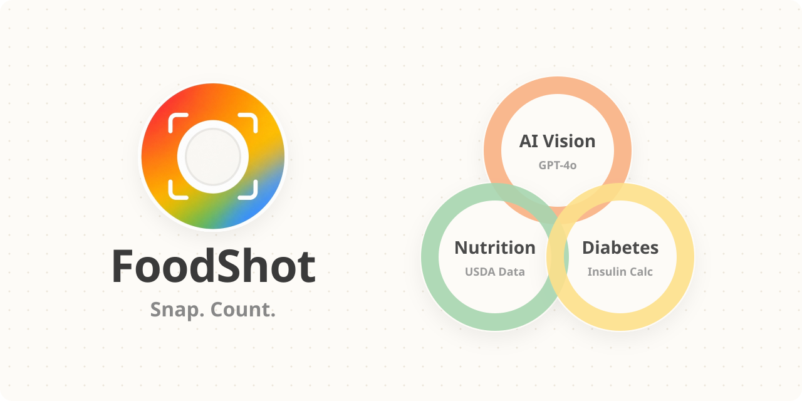
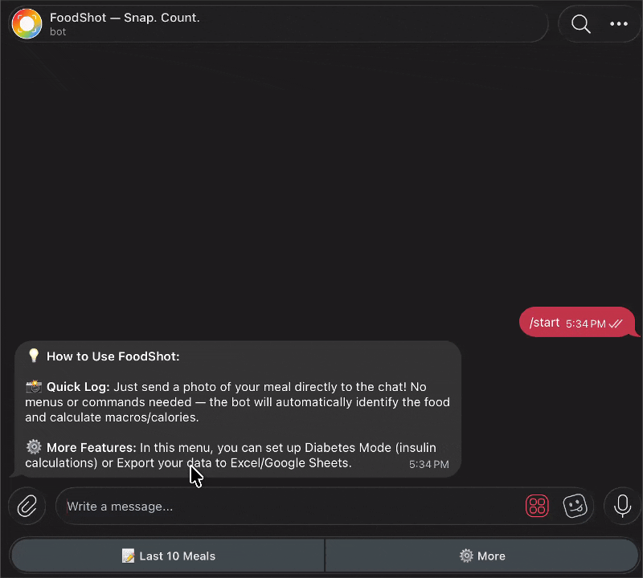
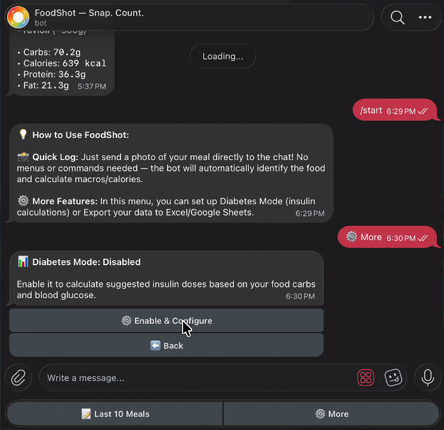
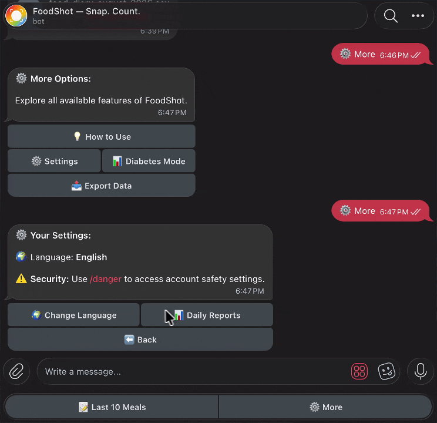
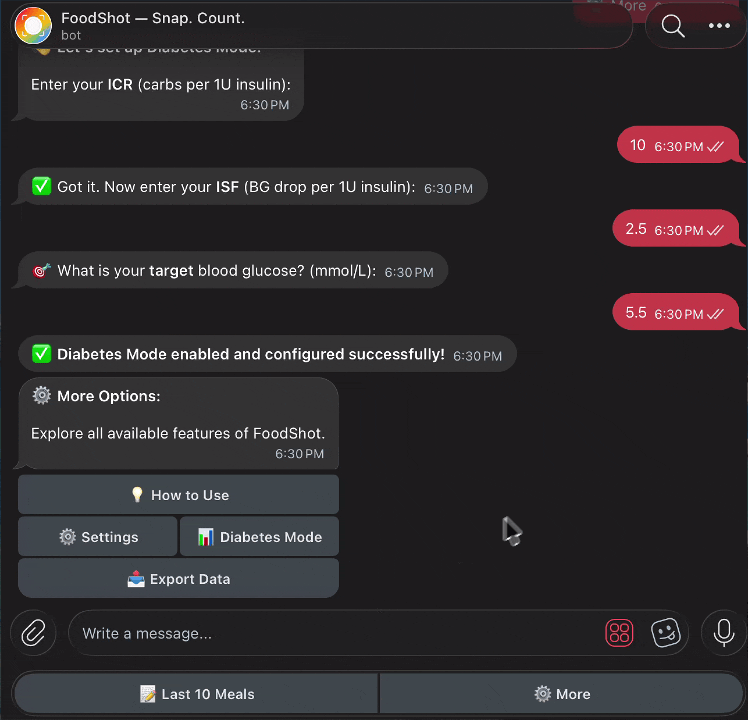
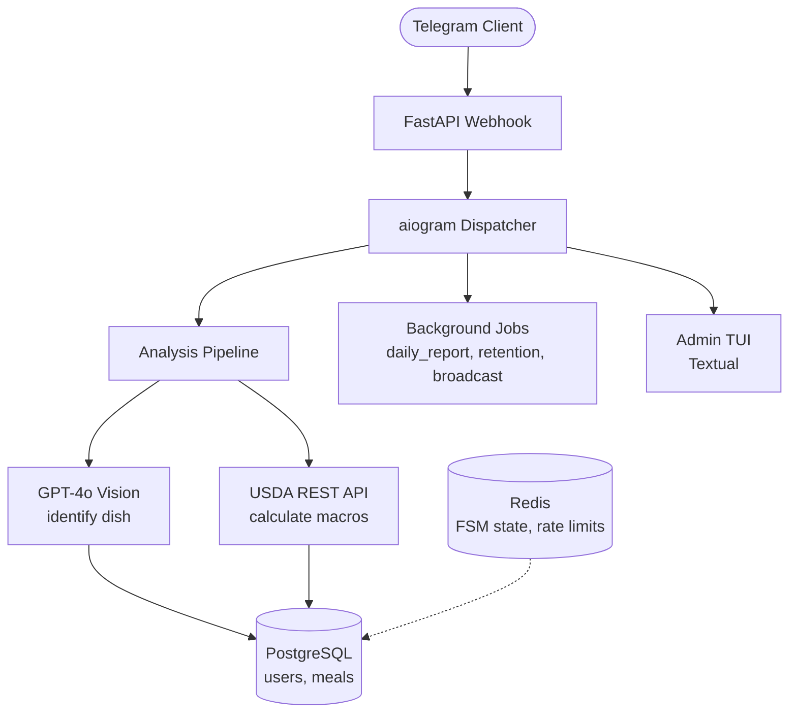
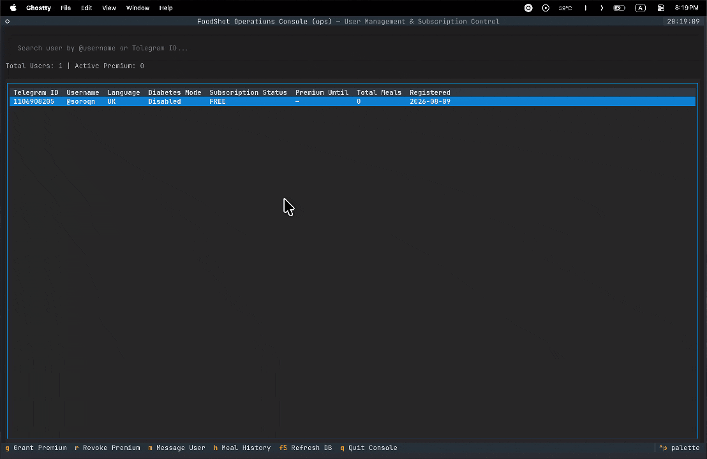

<div align="center">
  
</div>

<h3 align="center">FoodShot is a medical-grade nutrition diary — not a meal tracker.</h3>

<div align="center">
  It uses Telegram as a zero-friction interface to build daily habits. Snap a photo ➔ Vision AI identifies the dish ➔ USDA calculates exact macros. Every meal becomes structured, exportable data — built for people who take their health seriously.
</div>

---

## Features in Action

|  |  |
| :---: | :---: |
| **AI Food Recognition**<br>Snap a photo and get precise USDA nutrition instantly. | **Diabetes Mode**<br>Calculates suggested insulin boluses based on your ICR/ISF. |
|  |  |
| **Daily Report**<br>View your calorie and macronutrient progress for the day. | **Data Export & History**<br>Export your medical diary to CSV for your doctor. |

> **Disclaimer:** The bot is an assistant, not a doctor. All calculations are transparent but serve as estimates. It does not replace professional medical advice.

## Architecture

The simplified version. The real system has 6 layers — background job runners, a terminal admin panel, FSM state management, dual-source vision pipeline (OpenAI → Gemini fallback), dual-source nutrition pipeline (USDA → Nutritionix fallback), LLM observability via Langfuse, and Cloudflare Zero Trust routing. The diagram below doesn't do it justice.

→ [See the full architecture](./docs/architecture/README.md)



## Built-in Operations Console

Nobody expects a full terminal dashboard in a food tracker.

FoodShot ships with an interactive TUI (powered by Textual) to manage the entire system locally or over SSH — grant/revoke Premium access, browse meal history, resolve FSM state conflicts, all without touching SQL.

<div align="center">
  
</div>

→ [Admin console docs](./docs/admin.md)

## Getting Started

The fastest way — just open Telegram and try it:

[](https://t.me/foodshot_bot)

Want to run it locally or self-host:

```bash
git clone git@github.com:soroqn1/FoodShot.git && cd foodshot
cp .env.example .env
# fill in your keys, then:
task install && task dev   # start webhook & services
```

→ [Full setup guide](./docs/setup.md) — webhook mode, Cloudflare tunnel, migrations, all commands.

---

## Contributing

Issues and PRs are welcome. For significant changes — open an issue first to discuss what you'd like to change. Tests for medical math are strictly required.

---

## License

**Business Source License 1.1 (BUSL-1.1)**

You are completely free to clone, run, and modify this project for personal use, education.
Commercial or production use is strictly prohibited without explicit permission.

Commercial use — contact me directly.
