<div align="center">
  <h1>📸 FoodShot</h1>
  <p><b>Your AI-powered smart food diary and calorie/macro tracker.</b></p>
  <p><i>Snap a photo. Log calories. Track nutrients. Optional diabetes logging.</i></p>
</div>

---

## 🎯 The Problem We Solve
Keeping track of daily meals, calories, and macros can be time-consuming and tedious.

**FoodShot** makes food logging effortless. Built entirely inside Telegram, it allows you to simply snap a photo of your meal. The bot identifies the dish, estimates the portion weight using AI, fetches precise nutritional data (carbs, protein, fat, calories) from official databases (USDA), and logs it to your history.

For users managing diabetes, FoodShot features an optional **Diabetes Mode** that tracks blood glucose, ICR/ISF parameters, and estimates suggested insulin boluses using standard transparent medical formulas.

## ✨ Core Philosophy
- **Easy Logging:** Take a picture, get detailed nutrition info instantly, and save it to your history.
- **AI as a simple helper:** OpenAI GPT-4o Vision is strictly used for food and weight identification, not for medical advice or diary management.
- **Optional Medical Tracking:** Advanced diabetes settings are turned off by default, keeping the app simple for general users.
- **Doctor-Friendly Exports:** Export your history and glucose patterns into CSV/Excel for your doctor or nutritionist.

> **Disclaimer:** The bot is an assistant, not a doctor. All calculations are transparent but serve as estimates. It does not replace professional medical advice.

## 🛠 Tech Stack
We built FoodShot with modern, asynchronous, and scalable technologies:

- **Bot Framework:** [aiogram 3.x](https://docs.aiogram.dev/)
- **Web Server:** [FastAPI](https://fastapi.tiangolo.com/) (High-performance Webhook handler)
- **Database:** PostgreSQL 15 + SQLAlchemy 2.0 (`asyncpg`) + Alembic for migrations
- **State & Cache:** Redis 7 (for FSM and API caching)
- **Integrations:** OpenAI GPT-4o Vision API, USDA FoodData Central API
- **Deployment:** Docker, Docker Compose, Cloudflare Zero Trust Tunnels
- **Testing:** `pytest` + `pytest-asyncio`

## 🏗 Architecture
The system operates strictly via webhooks for maximum performance and zero polling overhead. Telegram sends updates to our FastAPI endpoint, which securely validates them via a secret token and routes them to `aiogram` handlers.



## 🚀 Getting Started (Local Development)

Want to run FoodShot locally to test it or record a demo? Here is the setup:

### Prerequisites
- Docker and Docker Compose
- Taskfile (`go-task`)
- Python 3.11+
- Poetry
- [ngrok](https://ngrok.com/) (for local webhooks)

### 1. Configuration
```bash
git clone <repo_url> && cd foodshot
cp .env.example .env
```
Edit `.env` and fill in your keys. Make sure you set a random `WEBHOOK_SECRET_TOKEN` (e.g., `my_secret_token_123`).

### 2. Start the Application
Install dependencies and start the database and bot locally:
```bash
task install
task dev
```

### 3. Setup Ngrok Webhook
In a new terminal window, expose your local port 8000 to the internet:
```bash
ngrok http 8000
```
Copy the `https://...ngrok-free.app` URL generated by ngrok.
Go back to your `.env` file and set:
```env
WEBHOOK_URL=https://<your-ngrok-url>.ngrok-free.app/webhook
```
Restart the bot (`task dev`), and it will automatically register the new webhook with Telegram!

## 🧪 Testing
We maintain rigorous tests for critical components, especially the medical math:
```bash
task test
```

## 📜 License
Commercial / Proprietary. Selected source files are made available for portfolio demonstration purposes only. All rights reserved.
