# FoodShot Architecture

Below is the complete architecture diagram of the FoodShot project, including all active modules, background jobs, Admin TUI, integrations, and the main bot pipeline.

```mermaid
flowchart TD
    %% Define Styles
    classDef user fill:#e1f5fe,stroke:#0288d1,stroke-width:2px,color:#000;
    classDef external fill:#f3e5f5,stroke:#7b1fa2,stroke-width:2px,color:#000;
    classDef bot fill:#e8f5e9,stroke:#388e3c,stroke-width:2px,color:#000;
    classDef service fill:#fff3e0,stroke:#f57c00,stroke-width:2px,color:#000;
    classDef db fill:#ffebee,stroke:#d32f2f,stroke-width:2px,color:#000;
    classDef core fill:#eceff1,stroke:#607d8b,stroke-width:2px,color:#000;
    classDef admin fill:#fce4ec,stroke:#c2185b,stroke-width:2px,color:#000;
    classDef jobs fill:#fffde7,stroke:#fbc02d,stroke-width:2px,color:#000;
    classDef dev fill:#f3f3f3,stroke:#9e9e9e,stroke-width:2px,stroke-dasharray: 5 5,color:#000;

    %% Actors & External Entities
    User(("User\n(Telegram)")):::user
    Admin(("Admin\n(Terminal)")):::admin
    TG["Telegram API"]:::external

    %% Development & QA Layer
    subgraph DevQA ["Development & QA Layer"]
        Tests["pytest\n(tests/)"]:::dev
        Ruff["Ruff\n(Linting & Formatting)"]:::dev
        Taskfile["Taskfile.yml\n(Task Runner)"]:::dev
    end

    %% Config & Localization (Core)
    subgraph Core ["0. Core (Config, Utils, i18n)"]
        Config["config.py\n(Pydantic Settings)"]:::core
        I18n["i18n.py & locales/\n(Translations)"]:::core
        Logger["logger.py (Loguru)"]:::core
        TimeUtils["time_utils.py\n(Timezone & Dates)"]:::core
    end

    %% Admin & Ops Layer
    subgraph Ops ["Admin / Ops (TUI)"]
        TUI["Textual UI Dashboard\n(ops/tui.py, views.py)"]:::admin
        Alembic["Alembic Migrations\n(migrations/)"]:::admin
    end

    %% Web Server & Entrypoints Layer
    subgraph Entrypoints ["1. Entrypoints"]
        Webhook["Webhook Endpoint\n(api/webhook.py)"]:::bot
        Polling["Dev Polling\n(bot_polling.py)"]:::bot
    end

    %% Bot Application Layer
    subgraph Bot_Layer ["2. Bot Application Layer (aiogram)"]
        Router["Message Router / Dispatcher"]:::bot
        
        subgraph Middlewares_Group ["Middlewares"]
            M_User["middlewares.py\n(User/Session Inject)"]:::bot
            M_I18n["i18n_middleware.py\n(Locale Inject)"]:::bot
        end
        
        subgraph Handlers ["Bot Handlers & UI"]
            H_Start["/start (Onboarding)"]:::bot
            H_Photo["photo.py (Analysis Flow)"]:::bot
            H_Settings["settings.py (Profile)"]:::bot
            H_History["history.py (DB View)"]:::bot
            H_Export["export.py (Data Export)"]:::bot
            H_Common["common.py"]:::bot
            States["states.py (FSM Definitions)"]:::bot
            Keyboards["keyboards.py (UI)"]:::bot
        end
    end

    %% Core Services Layer
    subgraph Service_Layer ["3. Core Services Layer (Business Logic)"]
        S_PhotoFlow["photo_flow.py\n(Pipeline Orchestrator)"]:::service
        S_Vision["vision.py\n(AI Wrapper & Image Compression via Pillow)"]:::service
        S_Nutrition["nutrition.py\n(Macro Fetcher)"]:::service
        S_Calc["calc.py\n(Bolus Formula)"]:::service
        S_Security["security.py\n(Rate-limiting & Anomaly)"]:::service
        S_Freemium["freemium.py\n(Daily Quota Logic)"]:::service
    end

    %% Background Jobs & Scripts Layer
    subgraph Background_Jobs ["Background Jobs & Scripts"]
        J_Daily["daily_report.py\n(Sends Daily Summaries)"]:::jobs
        J_Retention["retention.py\n(Data cleanup & Export generation)"]:::jobs
        J_Broadcast["broadcast.py / scripts/\n(Mass Messaging)"]:::jobs
        J_KeepAlive["keep_alive.py"]:::jobs
    end

    %% Data Access Layer
    subgraph Data_Layer ["4. Data Access Layer"]
        DB_Engine["database.py\n(Async Engine & Sessions)"]:::core
        CRUD["crud.py\n(Async DB Operations)"]:::core
        Models["models.py\n(SQLAlchemy Schemas)"]:::core
    end

    %% Infrastructure & DBs
    subgraph Infrastructure ["5. Infrastructure (Docker Compose)"]
        PostgreSQL[("PostgreSQL\n(users, meal_logs)")]:::db
        Redis[("Redis\n(FSM State & Limits)")]:::db
        Cloudflared["Cloudflare Tunnel\n(cloudflared)"]:::db
    end

    %% External APIs
    subgraph External_APIs ["6. External APIs"]
        OpenAI["OpenAI\n(GPT-4o Vision)"]:::external
        Gemini["Google Gemini\n(Fallback Vision)"]:::external
        USDA["USDA FoodData Central\n(Primary)"]:::external
        Nutritionix["Nutritionix\n(Fallback)"]:::external
        Langfuse["Langfuse\n(LLM Observability / Tracing)"]:::external
    end

    %% ==========================================
    %% Relationships & Flow
    %% ==========================================

    %% Config injection (virtual)
    Config -. "Loads Env Vars" .-> Entrypoints
    Config -. "Provides DB URI" .-> DB_Engine
    Config -. "Provides API Keys" .-> External_APIs

    %% Admin & DB Management
    Admin -- "CLI / Terminal" --> TUI
    Admin -- "Applies schema" --> Alembic
    Alembic -. "Migrates DB" .-> PostgreSQL
    TUI -. "Reads/Writes via DB Engine" .-> DB_Engine

    %% User to Bot
    User -- "Sends Photo/Text" --> TG
    TG -- "1a. Webhook Event via Tunnel" --> Cloudflared
    Cloudflared -- "Routes to localhost" --> Webhook
    TG -- "1b. Long Polling" --> Polling
    Webhook -- "Forwards Update" --> Router
    Polling -- "Fetches Updates" --> Router
    
    %% Router to Handlers
    Router --> Middlewares_Group
    Middlewares_Group --> H_Start
    Middlewares_Group --> H_Photo
    Middlewares_Group --> H_Settings
    Middlewares_Group --> H_History
    Middlewares_Group --> H_Export
    Middlewares_Group --> H_Common
    
    %% Bot responding
    Handlers -- "Replies (bot.send_message)" --> TG

    %% Background Jobs Flow
    J_Daily -. "Sends scheduled reports" .-> TG
    J_Daily -. "Fetches logs" .-> CRUD
    J_Retention -. "Cleans & Exports" .-> CRUD
    J_Broadcast -. "Sends updates" .-> TG
    J_Broadcast -. "Fetches users" .-> CRUD
    
    %% Localization
    I18n -. "Provides strings" .-> M_I18n
    M_I18n -. "Translates UI" .-> Handlers
    
    %% Handler to Service
    H_Photo -- "Initiates Analysis Pipeline" --> S_PhotoFlow
    
    %% Security & Freemium checks
    H_Photo -. "Rate Limit Check" .-> S_Security
    H_Photo -. "Quota Check" .-> S_Freemium
    
    %% Photo Flow Orchestration
    S_PhotoFlow -- "1. Identify & Weigh" --> S_Vision
    S_Vision -- "Traced via API" --> Langfuse
    S_Vision -- "REST API" --> OpenAI
    S_Vision -. "Fallback" .-> Gemini
    
    S_PhotoFlow -- "2. Fetch Macros" --> S_Nutrition
    S_Nutrition -- "REST API" --> USDA
    S_Nutrition -- "REST API" --> Nutritionix
    
    S_PhotoFlow -- "3. Calculate Insulin" --> S_Calc
    
    %% State & Data Operations
    Router -. "Reads/Writes FSM State" .-> Redis
    States -. "Defines Flow" .-> H_Start
    States -. "Defines Flow" .-> H_Photo
    States -. "Defines Flow" .-> H_Settings
    Keyboards -. "Renders Buttons" .-> Handlers
    S_Security -. "Token Bucket / Limits" .-> Redis
    
    %% DB Interactions via CRUD
    H_Start -. "Create Profile" .-> CRUD
    H_Settings -. "Update Profile" .-> CRUD
    H_History -. "Fetch 10 Logs" .-> CRUD
    H_Export -. "Fetch History for CSV" .-> CRUD
    S_PhotoFlow -. "Save Meal Log" .-> CRUD
    S_Freemium -. "Check Free Tier Usage" .-> CRUD
    
    CRUD --> DB_Engine
    DB_Engine --> Models
    Models --> PostgreSQL
```

## Technology Stack

The project relies on a modern asynchronous Python stack, structured for scalability, performance, and clear separation of concerns.

### Core Application
- **Python 3.11-3.13**: Core programming language.
- **Poetry**: Dependency management and packaging.
- **Taskfile (go-task)**: Task runner for development commands (linting, testing, docker orchestration).
- **Ruff**: Extremely fast Python linter and formatter used to enforce strict code quality.

### Bot & Web Server
- **aiogram 3.x**: Modern asynchronous framework for Telegram Bot API. Handles updates, routing, FSM (Finite State Machine), and keyboards.
- **FastAPI**: High-performance web framework used for the webhook endpoint to receive updates from Telegram.
- **Uvicorn**: ASGI web server implementation for Python.

### Database & Caching
- **PostgreSQL**: Primary relational database storing users, meal logs, and settings.
- **SQLAlchemy (Async)**: Object Relational Mapper for asynchronous database interactions.
- **Alembic**: Database migration tool for managing schema changes.
- **Redis**: In-memory data store used for:
  - FSM state storage (`aiogram.fsm.storage.redis`)
  - Webhook idempotency (`webhook:update`)
  - Burst rate-limiting (`security:burst`)
  - Freemium quota counters (`quota:freemium`)
  - Caching USDA nutrition data to reduce external API calls
  - Distributed locks for background jobs (e.g., daily reports)

### External Integrations (APIs)
- **OpenAI GPT-4o Vision**: Primary AI engine for recognizing dishes and estimating weights from photos. Prompted to return structured JSON data via Pydantic models.
- **Google Gemini**: Fallback vision model if OpenAI fails.
- **USDA FoodData Central API**: Primary source for accurate macro-nutrients (calories, carbs, protein, fat) based on recognized dish names.
- **Nutritionix API**: Fallback source for nutritional data.
- **Langfuse**: LLM observability and tracing platform to monitor API costs, prompt performance, and latency.

### Infrastructure & Deployment
- **Docker & Docker Compose**: Containerization and local/production orchestration.
- **Cloudflared (Cloudflare Tunnel)**: Securely exposes the local development server to the internet for Telegram Webhooks.

---

## Architecture Principles & Working Logic

### 1. The Core Pipeline: Photo Analysis Flow
The primary value of FoodShot is the seamless transition from a user photo to an insulin bolus recommendation. This pipeline is strictly defined in `photo_flow.py` and relies on specific service boundaries.

**Step-by-step Execution:**
1. **Photo Reception**: The user sends a photo. The Webhook endpoint (FastAPI) receives it and passes it to the aiogram Router.
2. **Rate & Quota Limits**: `security.py` checks burst limits (Token Bucket via Redis) and `freemium.py` validates daily quotas.
3. **Vision Recognition**: The photo is compressed (via Pillow) and sent to OpenAI GPT-4o. The bot uses a strict system prompt to force the LLM to return a JSON object (`FoodRecognitionResult`) containing the dish name (in English and localized), estimated weight in grams, and a confidence score.
4. **Nutrition Fetching**: The English dish name is queried against the USDA API (`nutrition.py`). To optimize latency and reduce API costs, results are cached in Redis for 7 days.
5. **Bolus Calculation**: `calc.py` applies a transparent mathematical formula using the user's specific health parameters. 

### 2. Medical Transparency Constraint
A critical design principle is that AI (GPT-4o/Gemini) is **only used for visual recognition**. 
- The AI does not calculate macros.
- The AI does not provide medical advice.
- All nutritional data strictly comes from verified databases (USDA).
- All insulin calculations use transparent math formulas based on the user's Insulin-to-Carb Ratio (ICR), Insulin Sensitivity Factor (ISF), and Target Blood Glucose.

**Bolus Formula:**
- **Carb Dose** = Carbohydrates (g) / ICR
- **Correction Dose** = (Current BG - Target BG) / ISF (Applied only if Current BG > Target BG)
- **Total Dose** = Carb Dose + Correction Dose

### 3. Asynchronous by Default
Every layer of the application is designed to be non-blocking. 
- Database queries use `asyncpg` and async SQLAlchemy sessions.
- External API calls (OpenAI, USDA, Langfuse) use `aiohttp` or async wrappers.
- The entrypoint uses FastAPI with ASGI for high-throughput webhook handling.

### 4. Background Jobs & Orchestration
Separate background processes manage out-of-band tasks without blocking the main bot handlers:
- **Daily Reports** (`daily_report.py`): Runs continuously, checking user timezones to send customized daily summaries. Redis locks ensure idempotency (preventing duplicate reports).
- **Data Retention** (`retention.py`): Cleans up old states and generates export data asynchronously.

### 5. Separation of Concerns
- **Entrypoints** (FastAPI, Polling) are completely decoupled from **Bot Logic** (aiogram handlers).
- **Services** contain pure business logic (vision, nutrition, calculations) and do not know about Telegram updates or DB sessions.
- **Data Access** is abstracted behind `crud.py`, ensuring services only deal with standard Python types or Pydantic models, while `crud.py` manages SQLAlchemy ORM objects.
